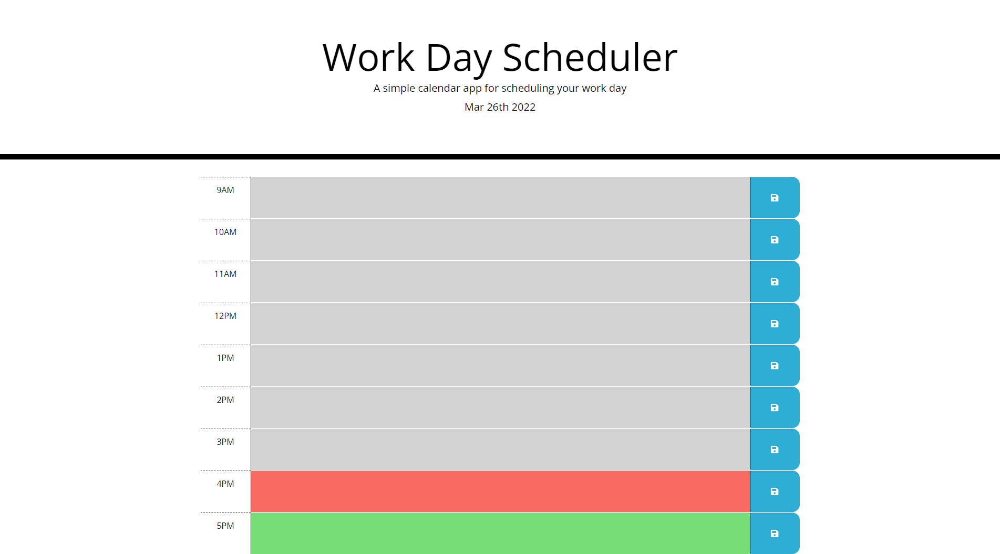

# busy-event-planner

## Descripstion

A day to day planner that lets you keep track on your routine. Plan out your routine using the text description, then save by click on the save button. It even lets you know where your at in the day with the color coded blocks that change depending on the time of day. When you refresh the page your whole routine will still appear.

## Built

* HTML
* CSS
* Bootstrap
* jQuery
* Moment.js

## Screenshot

## Link

https://hectcast508.github.io/busy-event-planner/ 

## Contribution

Made by Hector Castaneda